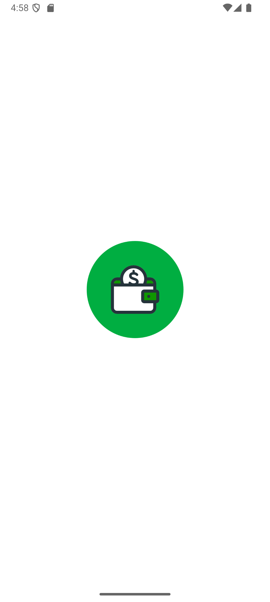
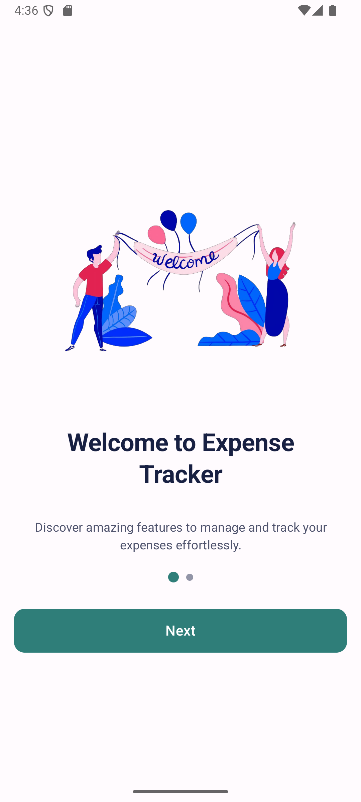
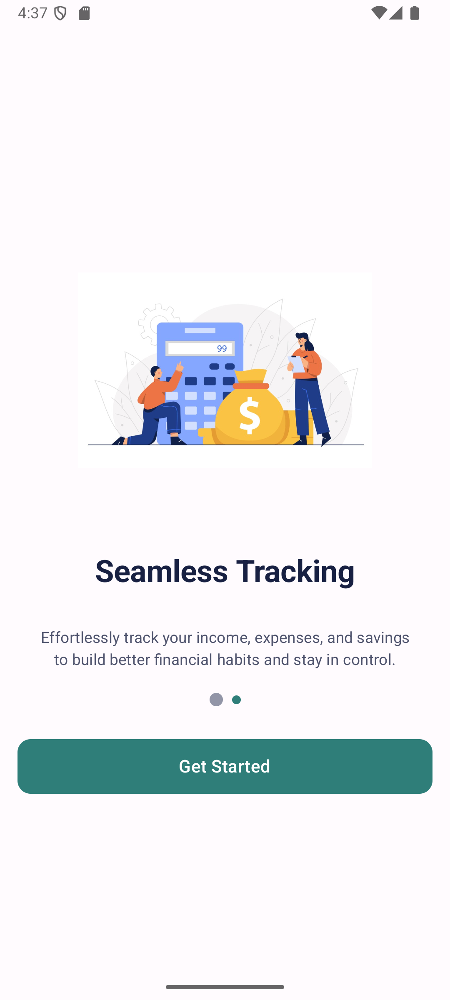
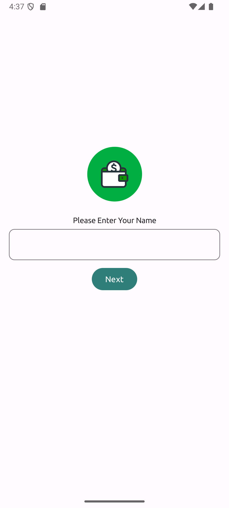
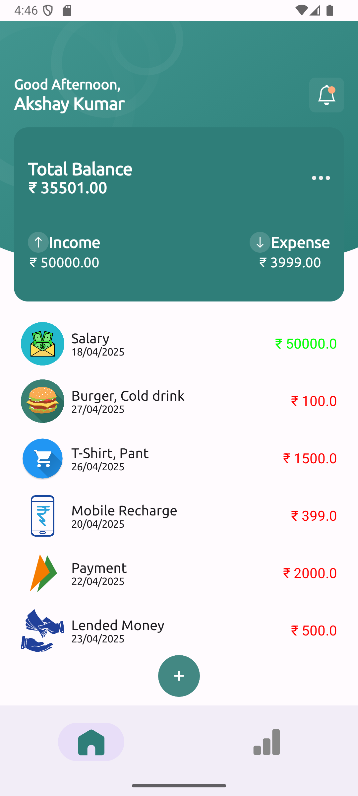
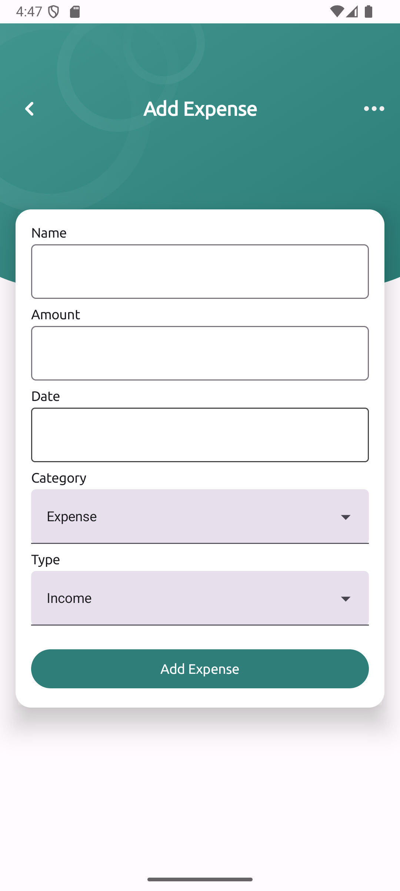
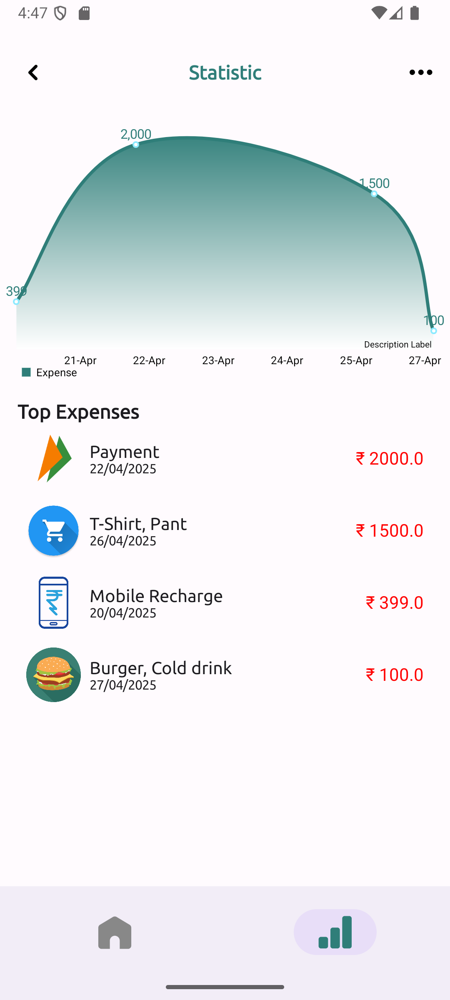

<h1 align="center">Expense Tracker App</h1>

  

  A simple and powerful Android application to manage and track your incomes and expenses locally with beautiful stats and smooth UI.

---

<h2>📱 Screenshots</h2>

<table>
  <tr>
    <td align="center">
      
      
Logo Screen

    </td>
    <td align="center">
      
      
Welcome Screen 1

    </td>
    <td align="center">
      
      
Welcome Screen 2

    </td>
  </tr>
  <tr>
    <td align="center">
      
      
User Name Input

    </td>
    <td align="center">
      
      
Home Screen

    </td>
    <td align="center">
      
      
Add Expense Screen

    </td>
  </tr>
  <tr>
    <td align="center">
      
      
Stats Screen

    </td>
  </tr>
</table>

---

<h2>🚀 Features</h2>
<ul>
  <li>Add Income and Expenses in different categories like Food, Recharge, Shopping, Payment, etc.</li>
  <li>Track and manage your daily transactions.</li>
  <li>Visual Statistics for Income vs Expense.</li>
  <li>Locally store user data securely using Room Database.</li>
  <li>User-friendly interface and smooth navigation.</li>
</ul>

---

<h2>🛠️ Tech Stack Used</h2>
<ul>
  <li><strong>Language:</strong> Kotlin</li>
  <li><strong>Architecture:</strong> MVVM (Model-View-ViewModel)</li>
  <li><strong>Database:</strong> Room Database (local storage)</li>
  <li><strong>Jetpack Compose:</strong> UI development</li>
</ul>

---

<h2>📂 Project Structure (MVVM)</h2>

<ul>
  <li><strong>Model:</strong> Data classes, Entities for database</li>
  <li><strong>View:</strong> Composables (UI screens)</li>
  <li><strong>ViewModel:</strong> Business logic, database operations</li>
</ul>

---

